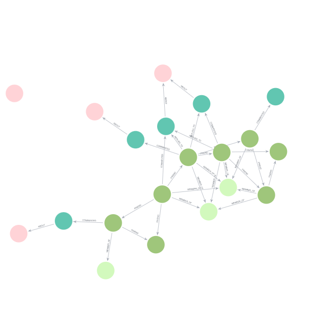

# Social Network Analysis with Neo4j

A graph database project that models a small social network in **Neo4j** and analyses it with **Cypher** queries. It covers ego networks, friends-of-friends, shortest paths, network diameter, group and topic communities, toxic-comment detection, and a friend recommendation engine.

Built as part of the MBA (Data Science & Analytics) coursework at Symbiosis Centre for Information Technology (SCIT), Pune.

## Graph Model

**20 nodes · 32 relationships**

| Node | Count | Key properties |
|---|---|---|
| `User` | 8 | name, age, city, profession, activityLevel, influenceScore |
| `Group` | 3 | name, category, members |
| `Comment` | 5 | text, sentiment, toxicity, likes, timestamp |
| `Topic` | 4 | name |

| Relationship | Pattern | Properties |
|---|---|---|
| `FRIEND` | User → User | since, strength |
| `MEMBER_OF` | User → Group | role, since |
| `COMMENTED` | User → Comment | time |
| `REPLIED_TO` | User → Comment | — |
| `ABOUT` | Comment → Topic | — |

## Files

| File | Description |
|---|---|
| `social_network_neo4j_1.cypher` | Full script: graph setup and all 16 exercise queries |
| `ex *.png` | Graph visualisation output for each exercise |
| `ex 7b table version.csv` | Shortest path between every pair of users |
| `ex 13 table version.csv` | Users discussing the same topic |
| `ex 15b.csv` | Ranked friend recommendations |

## Exercises

| # | Analysis | Cypher concept |
|---|---|---|
| 1–2 | Complete user network and friendships only | Basic pattern matching |
| 3 | Rahul's one-hop ego network | Undirected relationships |
| 4 | Friends-of-friends (exactly 2 hops, excluding direct friends) | Variable-length paths, `NOT` patterns |
| 5–6 | 1–3 hop reach; all paths between two users | `*1..3` path ranges |
| 7a / 7b | Shortest connection between users, for every pair | `shortestPath()` |
| 8a / 8b | Longest simple path and network diameter | List predicates, `ORDER BY` + `LIMIT` |
| 9 | Users and groups | Bipartite pattern |
| 10–12 | Comments, reply threads, and comment → topic chains | Multi-hop patterns |
| 13 | Users discussing the same topic | Shared-neighbour matching |
| 14 | High-toxicity interactions (toxicity ≥ 0.10) | `WHERE` filters, `OPTIONAL MATCH` |
| 15a / 15b | Friend recommendations ranked by mutual friends and shared groups | Aggregation, `collect()`, scoring |
| 16 | Complete interaction graph, including isolated nodes | `OPTIONAL MATCH` |

## Key Findings

- **Network diameter is 4 hops.** The most distant users, such as Amit ↔ Arjun and Karan ↔ Meera, are connected only through the chain Rahul → Priya → Neha.
- **Priya is the bridge of the network.** She appears in most of the shortest paths and links the Pune cluster (Rahul, Amit, Karan) to the Delhi and Bengaluru cluster (Neha, Arjun, Meera).
- **Friend recommendations for Rahul:** Neha scores 3 (1 mutual friend and 2 shared groups) and Sneha scores 2 (1 mutual friend and 1 shared group).
- **Shared interest:** Rahul and Neha both commented on *Graph Database*.
- **Toxicity:** only one comment (C005, by Sneha) crosses the 0.10 threshold.
- The *Social Network Analysis* topic has no comments linked to it, so it appears as an isolated node.

## How to Run

1. Open **Neo4j Desktop**, **Neo4j Aura** (free tier), or the Neo4j Sandbox.
2. Open `social_network_neo4j_1.cypher` and run each block separately in Neo4j Browser with **Ctrl + Enter**.
3. Run block `0. RESET` first. It clears the database.
4. Run blocks 1–9 to build the graph. The sanity check should return **20 nodes and 32 relationships**.
5. Run any exercise query to see its
